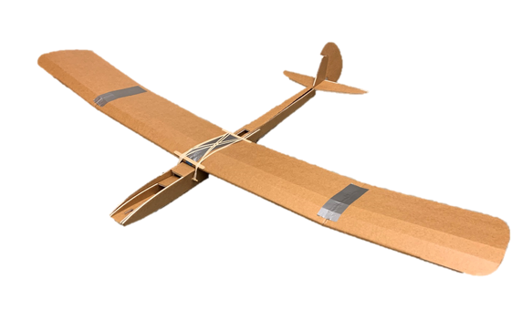
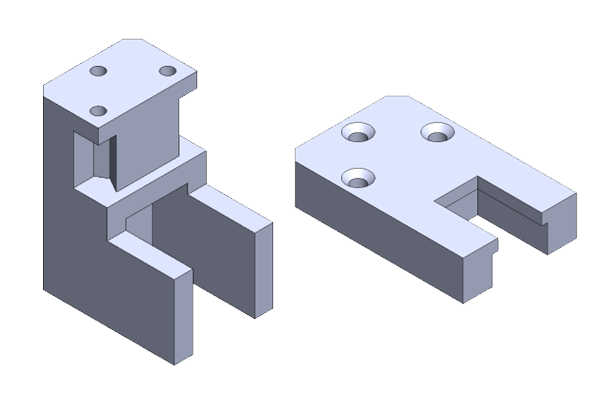
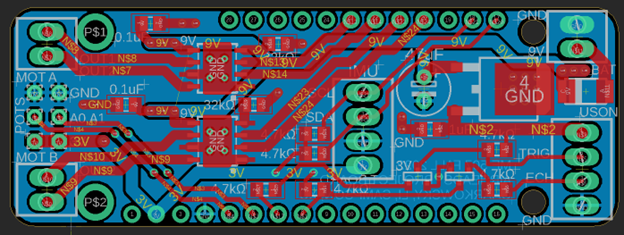
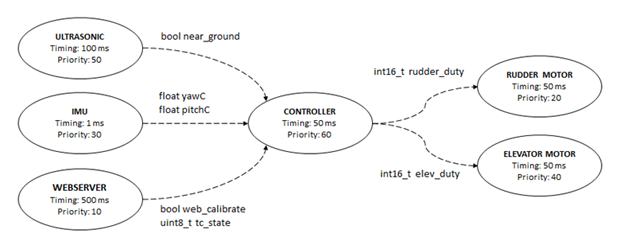
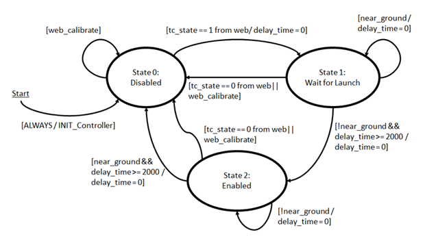
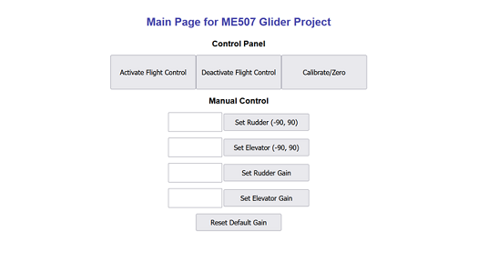

#  ME507 Airheads Glider Project

This repository documents the development of a flight stabilization system for a glider.

## Background

This is a term project for Cal Poly's ME507 class. The scope of our project consists of:

- Background/Research and Identifying Specifications
- Hardware Design
- Custom PCB Design
- Software Design
- Internet of Things Implementation
- Proper Documentation 

## Hardware Design

To make this project more challenging and more fitting for ME507, we decided to use micro servo body DC motors instead of servos. To implement some form of feedback for the position of the motors, a motor mount was designed to couple a potentiometer to the shaft of the motor.

<!--   -->

## Custom PCB Design

Our custom PCB is designed to fit on an ESP32 feather board.

<!--  -->

The board supports:
- Two DRV8871 Motor Driver Chips
- Two Potentiometers
- One HC-SR04 Ultrasonic Sensor
- One LIS3MDL + LSM6DSOX IMU Breakout Board

## Software Design

The software includes the following tasks:
- PID Flight Controller
- Ultrasonic Sensor
- Elevator Motor
- Rudder Motor
- Webserver
- IMU

The tasks are organized as shown below in the task diagram.

Our controller task is structured as a finite state machine with three states.

Every task runs "simultaneously" though cooperative multitasking with FreeRTOS.

## Internet of Things (IoT)

To implement the IoT, the ESP32's Wi-Fi module is used to host webpage where the user can interact with the flight control system.

<!--   -->

Through the webpage, we have the capability to activate, deactivate, and calibrate the flight control system. With more time, we would like to enable our program to support GET or POST requests to accept the user's typed input. This way we can seamlessly update our PID gains without recompiling and uploading our program for each iteration. 

## Documentation

For full documentation of our code, please visit [here](https://damondli.github.io/).
